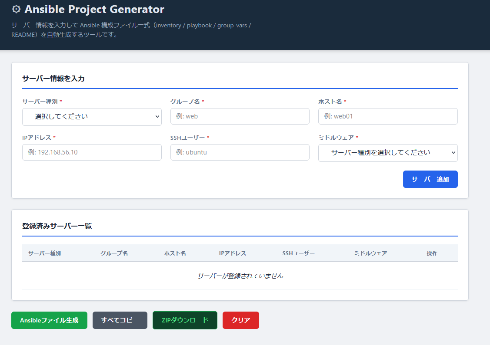

# Ansible Project Generator

**デモ URL**: https://ergtronix.github.io/ansible-project-generator/

## 動作画面



## 概要

このアプリは、Web画面でサーバー情報を入力すると、Ansibleで利用できる構成ファイル一式を自動生成するWebアプリです。

## 作成目的

インフラ構築やサーバー管理で利用されるAnsibleのInventoryやPlaybook作成を簡略化し、構築自動化の基本を学習することを目的としています。

## 主な機能

- サーバー情報の入力（種別・グループ名・ホスト名・IPアドレス・SSHユーザー・ミドルウェア）
- サーバー種別の選択（Webサーバー / APサーバー / DBサーバー / 監視サーバー）
- 登録済みサーバー一覧の表示・削除
- `inventory.ini` の生成
- `playbook.yml` の生成
- `group_vars/all.yml` の生成
- `README_ansible.md` の生成
- 生成結果の個別コピー・一括コピー
- localStorageによる登録情報の保存（ブラウザ再読み込み後も復元）

## 使い方

1. サーバー種別をセレクトボックスから選択する
2. グループ名、ホスト名、IPアドレス、SSHユーザーを入力する
3. ミドルウェアをセレクトボックスから選択する
4. 「サーバー追加」ボタンを押す
5. 必要なサーバーを複数追加する
6. 「Ansibleファイル生成」ボタンを押す
7. 生成されたファイル内容をコピーして利用する

## 生成されるファイル

| ファイル | 内容 |
|---|---|
| `inventory.ini` | グループ別のホスト一覧 |
| `playbook.yml` | ミドルウェアインストール等のタスク定義 |
| `group_vars/all.yml` | 共通変数の雛形 |
| `README_ansible.md` | Ansible実行手順の説明 |

## 対応サーバー種別とミドルウェア

| サーバー種別 | 対応ミドルウェア |
|---|---|
| Webサーバー | nginx, apache2, httpd |
| APサーバー | nodejs, python3, git |
| DBサーバー | mysql-server, postgresql |
| 監視サーバー | prometheus, node-exporter, htop, curl |

## 実行イメージ

```bash
ansible-playbook -i inventory.ini playbook.yml
```

接続確認:

```bash
ansible all -i inventory.ini -m ping
```

## 注意事項

このアプリは学習課題用の雛形生成アプリです。
実際の本番環境で利用する場合は、OS・パッケージ名・認証情報・権限・ネットワーク・セキュリティ設定を十分に確認してください。

## 今後の拡張予定

- YAML形式のInventory生成
- host_vars生成
- group_vars詳細設定
- OS種別ごとのPlaybook生成
- CSV読み込み機能
- 生成ファイルのZIPダウンロード
- Docker構築用Playbook生成
- nginx設定ファイルテンプレート生成
- DB初期設定Playbook生成
- SystemDNA構想への拡張

## GitHub Pagesでの公開方法

1. GitHubにpublicリポジトリを作成する
2. このプロジェクト一式をpushする
3. GitHubのリポジトリ設定から **Pages** を開く
4. Branch を `main`、Folder を `/ (root)` に設定する
5. 発行されたURLにアクセスする

## ファイル構成

```
ansible-project-generator/
├── index.html   # メイン画面
├── style.css    # スタイルシート
├── script.js    # アプリケーションロジック
└── README.md    # このファイル
```

ビルド不要。`index.html` をブラウザで直接開くだけで動作します。
